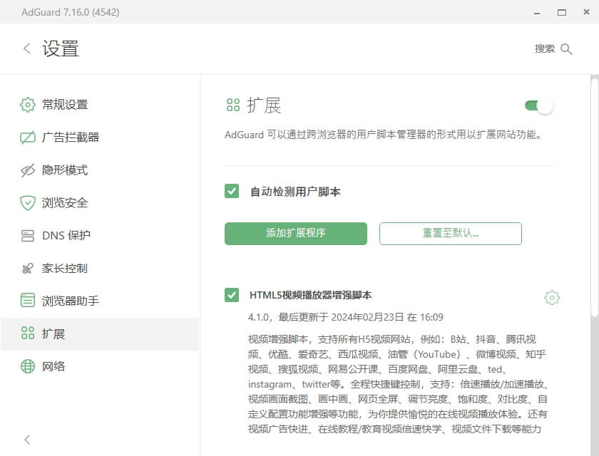

# Detailed Installation Guide

> Before installing the script, you need to install the [Tampermonkey extension](https://www.tampermonkey.net).
> [Tampermonkey](https://www.baidu.com/s?wd=%E6%B2%B9%E7%8C%B4%E6%8F%92%E4%BB%B6%E5%AE%89%E8%A3%85) is a highly regarded browser extension for loading user scripts, supporting Chrome, Edge, Firefox, Safari, Opera, and [many domestic browsers](https://www.baidu.com/s?wd=%E5%9B%BD%E5%86%85%E6%B5%8F%E8%A7%88%E5%99%A8).

**After installing the Tampermonkey extension**, click the link below for one-click installation:

- **[h5player.user.js (Click here to directly install)](https://update.greasyfork.org/scripts/381682/HTML5%E8%A7%86%E9%A2%91%E6%92%AD%E6%94%BE%E5%99%A8%E5%A2%9E%E5%BC%BA%E8%84%9A%E6%9C%AC.user.js)**

If you are first-time installing Tampermonkey, the methods are as follows:

## Standard Installation

> To install Tampermonkey normally, you just need to install it through the official website or the app store. However, often the links below may not be accessible in China, in which case refer to the domestic installation method below.

Tampermonkey official website: [https://www.tampermonkey.net](https://www.tampermonkey.net)
You can download and install it following the official website instructions or install it through the browser's app store.

If your network can access the app store address below, then install directly:

- [Tampermonkey - Chrome Web Store](https://chrome.google.com/webstore/detail/dhdgffkkebhmkfjojejmpbldmpobfkfo)
- [Tampermonkey - Edge Add-ons](https://microsoftedge.microsoft.com/addons/detail/iikmkjmpaadaobahmlepeloendndfphd)
- [Tampermonkey - Firefox Add-ons](https://addons.mozilla.org/en-US/firefox/addon/tampermonkey/)
- [Tampermonkey - Safari App Store](https://apps.apple.com/us/app/tampermonkey/id1482490089)
- [Tampermonkey - Opera Add-ons](https://addons.opera.com/en/extensions/details/tampermonkey-beta/)

**After installing the Tampermonkey extension**, click the link below to complete the script installation:

**[h5player.user.js (Click here to install the H5Player enhancement script)](https://update.greasyfork.org/scripts/381682/HTML5%E8%A7%86%E9%A2%91%E6%92%AD%E6%94%BE%E5%99%A8%E5%A2%9E%E5%BC%BA%E8%84%9A%E6%9C%AC.user.js)**

You can also enter the URL below in the browser's address bar to install the script:

- [https://h5player.anzz.top/h5player.user.js](https://h5player.anzz.top/h5player.user.js)

## Installation in China

> Due to the network environment in China, it is often not possible to install directly through the browser's app store. In this case, the offline installation method must be used to install Tampermonkey.

Below is the offline installation package of Tampermonkey. Download the offline package and then install it from the extension page of the browser.

### Step One: Download the Offline Package

The official address of Tampermonkey's offline package may not be accessible. If not, use the following domestic addresses, but if possible, please prioritize the official address:

- [Tampermonkey Offline Package](https://data.tampermonkey.net/tampermonkey_stable.crx)

Domestically accessible network disk file addresses:

- [Tampermonkey.crx - Lanzou Cloud](https://wwt.lanzouq.com/izahN1p5e0pg) Extraction Code: fn2o
- [Tampermonkey.crx - Baidu Cloud](https://pan.baidu.com/s/1ErjSyfI4W2mop1b452j1CQ?pwd=ayi3) Extraction Code: ayi3

If you are using a domestic browser such as 360 Extreme Browser, dragging the downloaded offline package to the browser window will complete the installation.

If not, or if direct dragging does not install, then please proceed with the steps below.

### Step Two: Enable Developer Mode

You can open the browser's extension page via the menu option or by entering `chrome://extensions/` in the address bar, then activating the developer mode.


### Step Three: Unzip the Offline Package and Load for Installation

The downloaded offline package is essentially a tar archive. On Windows, change the file name extension to `.tar` and unzip it using a tool like zip or rar, then go to the extension page, click on `Load unpacked`, and select the unzipped folder to complete the installation.

For macOS or Linux systems, unzip using the command line, then load and install via the extension page.

```bash
# Note to modify the file name according to the actual situation
tar -xvf tampermonkey_stable.crx
```

### Step Four: Install the h5player Enhancement Script

**[h5player.user.js (Click here to install the H5Player enhancement script)](https://update.greasyfork.org/scripts/381682/HTML5%E8%A7%86%E9%A2%91%E6%92%AD%E6%94%BE%E5%99%A8%E5%A2%9E%E5%BC%BA%E8%84%9A%E6%9C%AC.user.js)**

You can also enter the following URL in the browser's address bar to complete the script installation:

- [https://h5player.anzz.top/h5player.user.js](https://h5player.anzz.top/h5player.user.js)

The operational effect after installation is shown below:

<a href="https://h5player.anzz.top/assets/img/h5player_ui.jpg" target="_blank">
  
</a>

## Mobile Installation

For users with mobile needs, the script is also supported.

On mobile devices, Kiwi Browser is the recommended choice, as it can install the Tampermonkey plugin like a desktop environment and then install the script through Tampermonkey.

<a href="https://kiwibrowser.com/" target="_blank">
  
</a>

If you can access the Google Play Store, you can install Kiwi Browser directly through it.

If you cannot access the Google Play Store, you can download and install it through the following mirror addresses:

- [Kiwi Browser - apkcombo](https://apkcombo.com/zh/kiwi-browser/com.kiwibrowser.browser/)
- [Kiwi Browser - apkmirror](https://www.apkmirror.com/apk/geometry-ou/kiwi-browser-fast-quiet/)

If the above mirror addresses are inaccessible, download and install via the following cloud disk addresses:

- [Kiwi Browser - Lanzou Cloud](https://wwt.lanzouq.com/i8Pdp1p5z6cf) Extraction Code: 6hx7
- [Kiwi Browser - Baidu Cloud](https://pan.baidu.com/s/1ZPc7mIbiCoSXcymnRxWx5Q?pwd=m1yb) Extraction Code: m1yb

After installing the Kiwi Browser, install the Tampermonkey plugin by following the previous installation methods.

The operational effect after installation is shown below:

<a href="https://h5player.anzz.top/assets/img/kiwi_browser_effect01.83b4a12a.jpg" target="_blank">
  
</a>
<a href="https://h5player.anzz.top/assets/img/kiwi_browser_effect02.c5541da0.jpg" target="_blank">
  
</a>

## Installation on AdGuard Client

The [AdGuard](https://adguard.com) client also supports loading user scripts, and the h5player script can be installed and run via AdGuard. Compared to using the Tampermonkey plugin, there are some limitations to user scripts in AdGuard, but core functions are still supported.

The benefit of injecting scripts via the AdGuard client is that the script can be executed on any webpage, enabling the enhancement of some webpages that do not support the Tampermonkey client.

Currently, the script's support in this regard is not fully optimized. If you need to load the script in this way, please let me know via [issues](https://github.com/xxxily/h5player/issues), and I will decide whether to adapt and perfect it based on actual conditions.


